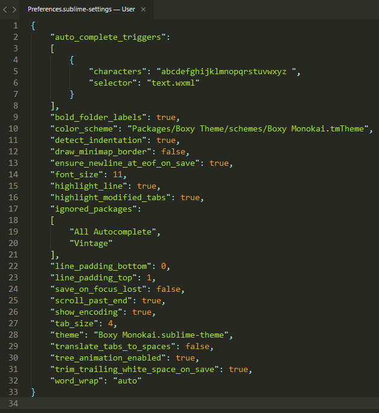
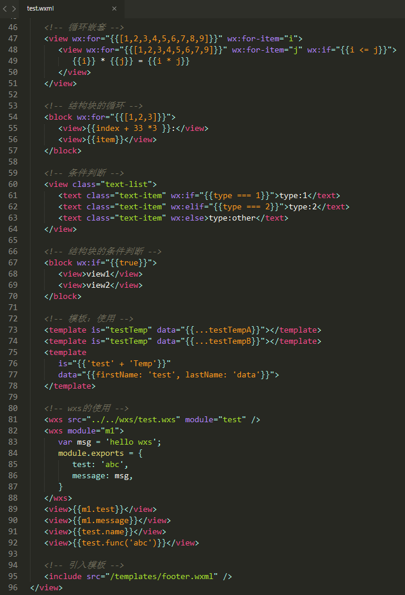
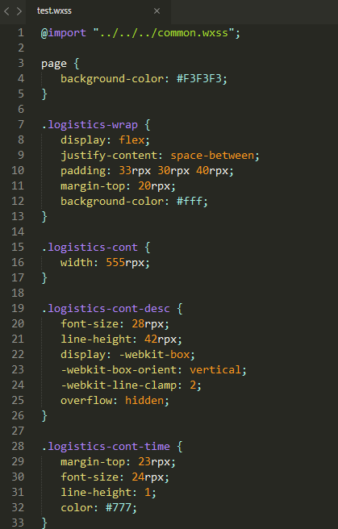
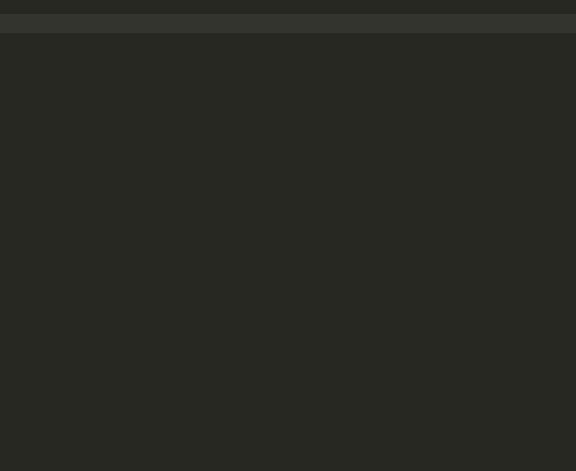
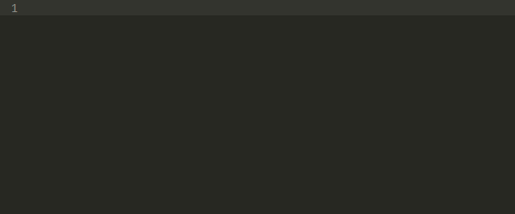
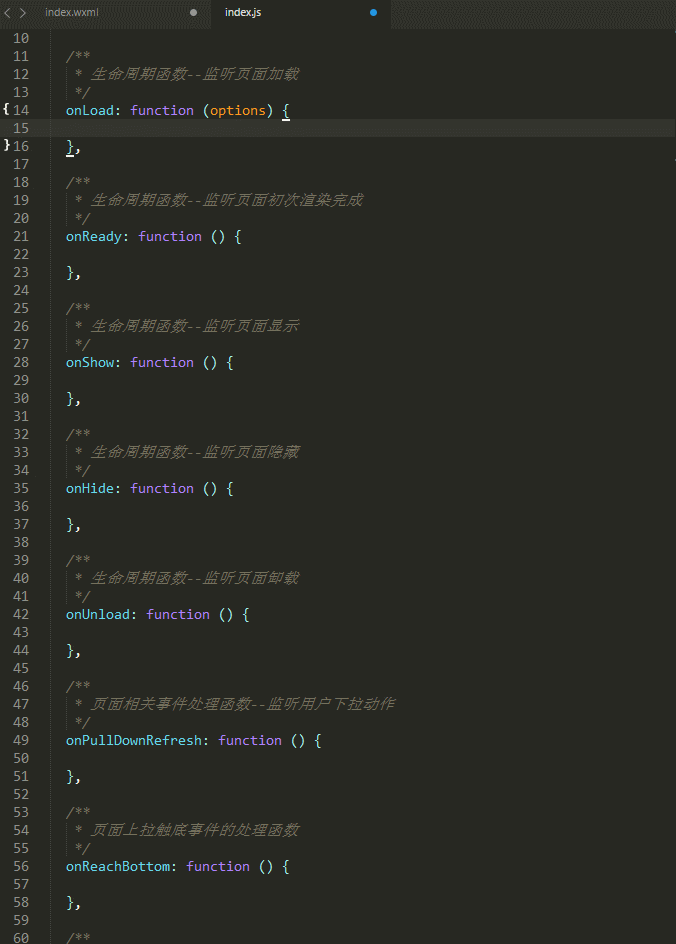

English | [简体中文](./docs/README.zh-ch.md)


# Sublime-wxapp

Sublime Text 3 syntax highlighting and auto completion for `.wxml` file(WeChat 'mini apps').

## Install

- Package Control

Search `Sublime wxapp` via Package Control: Install Package

- Git

Git clone this repository to Sublime Packages Path.

- Zip

Download zip and unzip to Sublime Packages Path.

## Setting

In order to improve WXML completion efficiency,you shuld edit your Preferences.sublime-settings and add config below:

```js
"auto_complete_triggers":
[
  {
    "characters": "abcdefghijklmnopqrstuvwxyz< :.",
    "selector": "text.wxml"
  }
],
```



## Feature

### `.wxml` file syntax highlighting



### `.wxss` file syntax highlighting



### WeChat 'mini apps' components auto completion

1： Support `view:if`、`view:for`、`view:class`.



2: Support `view.class` and `view#id`.


3: Will complement different content depending on the type of attribute values.


4: Support colon (:) matching.




### WeChat 'mini apps' apis auto completion


