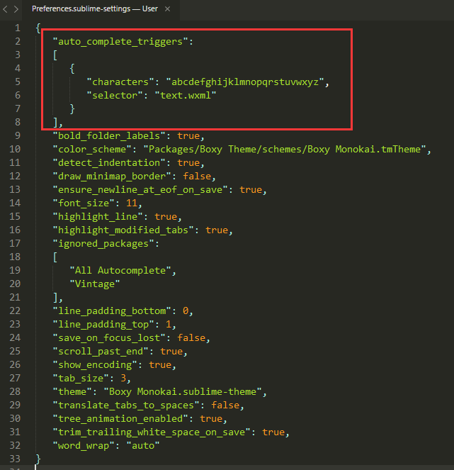
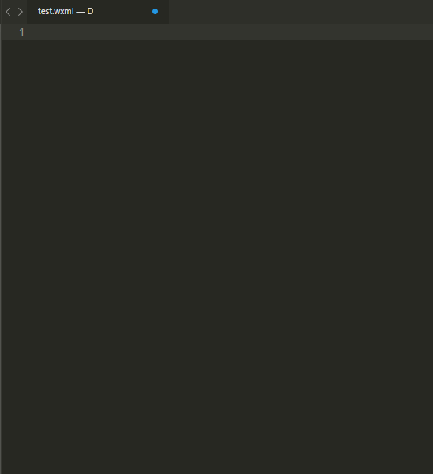

# Sublime-wxapp

Sublime Text 3 微信小程序语法高亮、代码提示插件！

微信开发者工具的编辑器虽然自带代码提示功能，但是就其编辑代码的体验和主题选择，个人觉得还是不太好用，所以还是想在自己熟悉的Sublime Text3上进行代码的编写工作。

## 安装

目前该插件还未完善，没有提交到Package Control。

目前使用该插件，需要下载zip包，将其解压到Sublime的插件安装目录。

为了提高wxml的补全效率，需要选择菜单(Preferences > Settings)，在打开的Preferences.sublime-settings用户配置文件中加入下面的代码：

```js
"auto_complete_triggers":
[
	{
		"characters": "abcdefghijklmnopqrstuvwxyz",
		"selector": "text.wxml"
	}
],
```



## 插件功能

**wxml文件的语法高亮**


**wxss文件的语法高亮**


**微信内置组件的代码提示和自动补全**



**微信API的代码提示和自动补全**


## 后期需完善的地方

1. wxss文件的语法高亮，目前是将其设置为css语法，rpx单位和内部组件标签无法高亮显示。
2. 微信内组件的代码提示和自动补全还不是很全，但是基本的需求够用。
3. 微信API的代码提示和自动补全也不是很全，但基本的也够用。
4. 有任何需求和疑问，欢迎提交[issues](./issues)