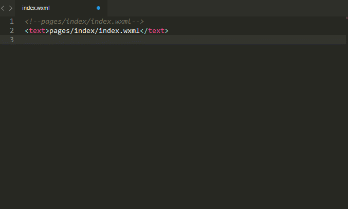

# Sublime-wxapp-snippets

Sublime下微信小程序的代码片段！

## 介绍

微信开发者工具的编辑器个人觉得还是不太好用，所以还是想在自己熟悉的Sublime Text3上进行代码编写工作。

百度查找了小程序关于Sublime Text的代码片段，找到了[weapp-snippet-for-sublime-text-2-3](https://github.com/Abbotton/weapp-snippet-for-sublime-text-2-3)项目，但是该项目已经停更了，为了满足自己的需要，在它整合的基础上，重新编辑了相关标签和api的代码片段。

详情见下图所示：

